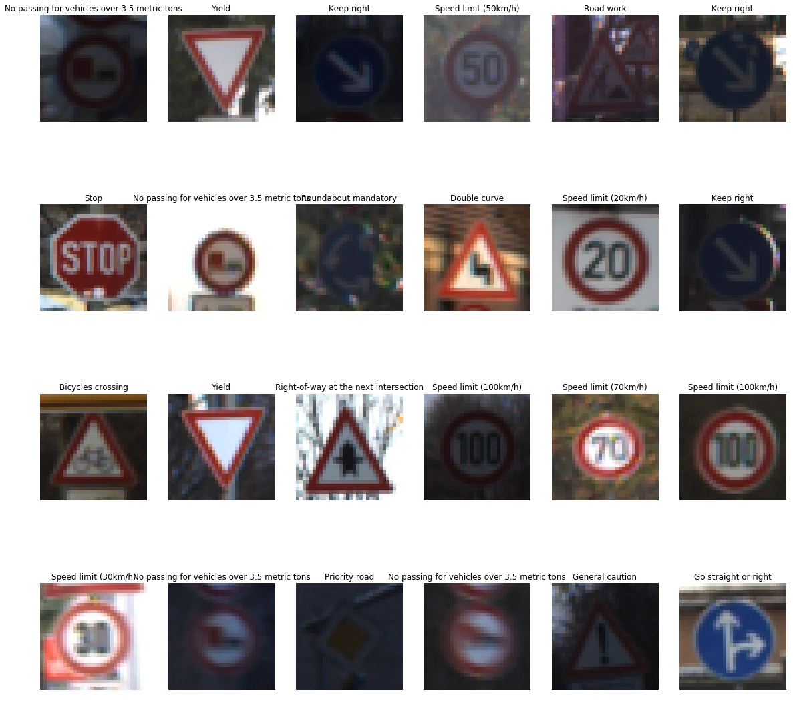
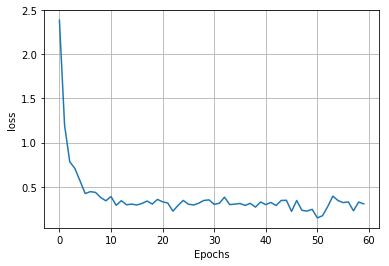
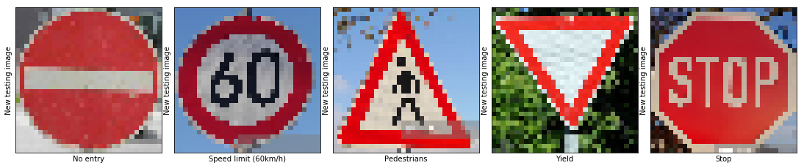
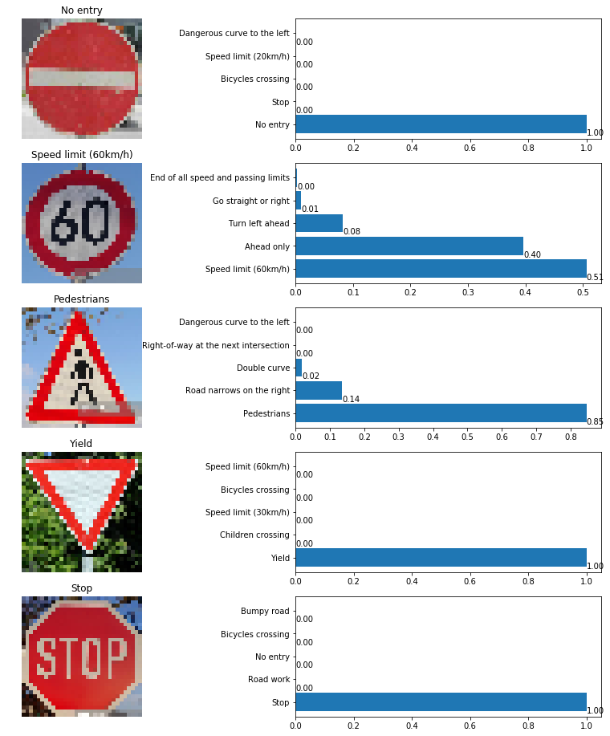

# Self Driving Car Engineer

## Deep Learning

## **Build a Traffic Sign Recognition Project**


- Link to my project on GitHub can be found here. [project code](https://github.com/udacity/CarND-Traffic-Sign-Classifier-Project/blob/master/Traffic_Sign_Classifier.ipynb)

### Data Set Summary & Exploration

#### Step 1
- Import all required libraries for the project

```python
# Import required libraries
import pickle
import numpy as np
import matplotlib.pyplot as plt
import random
from sklearn.utils import shuffle
import tensorflow as tf
from tensorflow.contrib.layers import flatten
import csv
import os
import cv2
```
- Read training, validation and test set pickle files from `data` folder.
```python
# Fill this in based on where you saved the training and testing data
training_file = "../data/train.p"
validation_file = "../data/valid.p"
testing_file = "../data/test.p"

with open(training_file, mode='rb') as f:
    train = pickle.load(f)
with open(validation_file, mode='rb') as f:
    valid = pickle.load(f)
with open(testing_file, mode='rb') as f:
    test = pickle.load(f)
    
X_train, y_train = train['features'], train['labels']
X_valid, y_valid = valid['features'], valid['labels']
X_test, y_test = test['features'], test['labels']
```

- Map traffic IDs to traffic signal name from csv file.
```python
# Mapping ClassID to traffic sign names
signs = []
with open('signnames.csv', 'r') as csvfile:
    signnames = csv.reader(csvfile, delimiter=',')
    next(signnames,None)
    for row in signnames:
        signs.append(row[1])
    csvfile.close()
```

#### Step 2
- Calculate summary statistics of the traffic
```python
# Number of training examples
n_train = len(X_train)

# Number of validation examples
n_validation = len(X_valid)

# Number of testing examples.
n_test = len(X_test)

# What's the shape of an traffic sign image?
image_shape = X_train[0].shape

# How many unique classes/labels there are in the dataset.
n_classes = len(np.unique(y_train))

print("Number of training examples =", n_train)
print("Number of validation examples =", n_validation)
print("Number of testing examples =", n_test)
print("Image data shape =", image_shape)
print("Number of classes =", n_classes)
```
> Number of training examples = 34799
Number of validation examples = 4410
Number of testing examples = 12630
Image data shape = (32, 32, 3)
Number of classes = 43
- Exploratory visualization of the data
--Randomly selected 24 images from the training data set and display them with their labels. Output images are shown in pictures.

```python
%matplotlib inline
fig, axs = plt.subplots(4, 6, figsize=(20,20))
axs = axs.ravel()
for i in range(24):
    index = random.randint(0, n_train)
    image = X_train[index]
    axs[i].axis('off')
    axs[i].imshow(image)
    axs[i].set_title(signs[y_train[index]])
```


### Design and Test a Model Architecture

#### 1. Describe how you pre processed the image data. 

As a first step, I decided to just shuffle the data so that the way data is fed to CNN will not matter in terms of order in which it is fed to it. Also I normalized it by dividing it by 255.

```python
#Shuffle Data and Normalize
X_train, y_train = shuffle(X_train, y_train)

X_train = X_train / 255.0
X_valid = X_valid / 255.0
X_test = X_test / 255.0
```

The difference between the original data set and the augmented data set is the following ... 


#### 2. Describe what your final model architecture looks like including model type, layers, layer sizes, connectivity, etc.) Consider including a diagram and/or table describing the final model.

I studied LeNet Architecture and soon I realized that there is a needs to be additional Convolutional Layer and Fully Connected Layer. Below if the table diagram describing my LeNet Architecture.

| Layer         		|     Description	        					| 
|:---------------------:|:---------------------------------------------:| 
| Input         		| 32x32x3 RGB image   							| 
| Convolution 5x5 | 5x5 filter with 1x1 stride, valid padding, Outputs 28x28x6 	|
| RELU |	|
| Convolution 5x5 | 5x5 filter with 2x2 stride, valid padding, Outputs 14x14x10	|
| RELU |	|
| Convolution 5x5 | 5x5 filter with 1x1 stride, valid padding, Outputs 8x8x16	|
| RELU |	|
| Convolution 5x5 | 5x5 filter with 1x1 stride, valid padding, Outputs 8x8x16	|
| RELU |	|
| Max Pooling | 2x2 ksize with 2x2 stride, valid padding, Outputs 4x4x16	|
| Flatten | Outputs 256	|
| FC Layer 1 | Input 256 and Outputs 120 |
| RELU |	|
| Dropout | Probab: 0.5 |
| FC Layer 2 | Input 120 and Outputs 100 |
| RELU |	|
| FC Layer 3 | Input 100 and Outputs 84 |
| RELU |	|
| FC Layer 4| Input 84 and Outputs 65 |
| RELU |	|
| FC Layer 5 Input 65 and Outputs 43 | 

```python
### Define your architecture here.

def LeNet(x):    
    # Hyperparameters
    mu = 0
    sigma = 0.1
    
    # Layer 1: Convolutional. Input = 32x32x3. Output = 28x28x6.
    layer_1_W = tf.Variable(tf.truncated_normal(shape=(5, 5, 3, 6), mean = mu, stddev = sigma))
    layer_1_b = tf.Variable(tf.zeros(6))
    layer_1 = tf.nn.conv2d(x, layer_1_W, strides=[1, 1, 1, 1], padding='VALID', use_cudnn_on_gpu = True)    
    layer_1 = tf.nn.bias_add(layer_1, layer_1_b)

    # Activation.
    layer_1 = tf.nn.relu(layer_1)
    
    # Layer 2: Convolutional. Input = 28x28x6. Output = 14x14x10.
    layer_2_W = tf.Variable(tf.truncated_normal(shape=(5, 5, 6, 10), mean = mu, stddev = sigma))
    layer_2_b = tf.Variable(tf.zeros(10))
    layer_2 = tf.nn.conv2d(layer_1, layer_2_W, strides=[1, 2, 2, 1], padding='VALID', use_cudnn_on_gpu = True)    
    layer_2 = tf.nn.bias_add(layer_2, layer_2_b)
                     
    # Activation.
    layer_2 = tf.nn.relu(layer_2)
    
    # Layer 3: Convolutional. Input = 14x14x10. Output = 8x8x16.
    layer_3_W = tf.Variable(tf.truncated_normal(shape = (5, 5, 10, 16), mean = mu, stddev = sigma))
    layer_3_b = tf.Variable(tf.zeros(16))
    layer_3 = tf.nn.conv2d(layer_2, layer_3_W, strides = [1, 1, 1, 1], padding = 'VALID', use_cudnn_on_gpu = True)    
    layer_3 = tf.nn.bias_add(layer_3, layer_3_b)
                     
    # Activation.
    layer_3 = tf.nn.relu(layer_3)

    # Pooling. Input = 8x8x16. Output = 4x4x16.
    layer_3 = tf.nn.max_pool(layer_3, ksize = [1,2,2,1], strides = [1,2,2,1], padding='VALID')
    
    # Flatten x. Input = 4x4x16. Output = 256.
    layer_3_flat = flatten(layer_3)
    
    # Layer 4: Fully Connected. Input = 256. Output = 120.
    fc_layer_1_W = tf.Variable(tf.truncated_normal(shape=(int(np.shape(layer_3_flat)[1]),120),mean = mu,stddev = sigma))
    fc_layer_1_b= tf.Variable(tf.zeros(120))
    fc_layer_1 = tf.matmul(layer_3_flat, fc_layer_1_W) + fc_layer_1_b
    
    # Activation.
    fc_layer_1 = tf.nn.relu(fc_layer_1)
    
    # Introduce Dropout after first fully connected layer
    fc_layer_1 = tf.nn.dropout(fc_layer_1, keep_prob)

    # Layer 5: Fully Connected. Input = 120. Output = 100.
    fc_layer_2_W = tf.Variable(tf.truncated_normal(shape=(120,100),mean=mu,stddev=sigma))
    fc_layer_2_b = tf.Variable(tf.zeros(100))
    fc_layer_2 = tf.matmul(fc_layer_1, fc_layer_2_W) + fc_layer_2_b
    
    # Activation.
    fc_layer_2 = tf.nn.relu(fc_layer_2)
    
    # Layer 6: Fully Connected. Input = 100. Output = 84.
    fc_layer_3_W = tf.Variable(tf.truncated_normal(shape=(100,84),mean=mu,stddev=sigma))
    fc_layer_3_b = tf.Variable(tf.zeros(84))
    fc_layer_3 = tf.matmul(fc_layer_2, fc_layer_3_W) + fc_layer_3_b
    
    # Activation.
    fc_layer_3 = tf.nn.relu(fc_layer_3)
    
    # Layer 7: Fully Connected. Input = 84. Output = 65.
    fc_layer_4_W = tf.Variable(tf.truncated_normal(shape=(84,65),mean=mu,stddev=sigma))
    fc_layer_4_b = tf.Variable(tf.zeros(65))
    fc_layer_4 = tf.matmul(fc_layer_3, fc_layer_4_W) + fc_layer_4_b
    
    # Activation.
    fc_layer_5 = tf.nn.relu(fc_layer_4)
    
    # Layer 8: Fully Connected. Input = 65. Output = 43.
    fc_layer_5_W = tf.Variable(tf.truncated_normal(shape=(65,43),mean=mu,stddev=sigma))
    fc_layer_5_b = tf.Variable(tf.zeros(43))
    fc_layer_5 = tf.matmul(fc_layer_5, fc_layer_5_W) + fc_layer_5_b
    
    logits = fc_layer_5
    
    return logits
```


#### 3. Describe how you trained your model. The discussion can include the type of optimizer, the batch size, number of epochs and any hyperparameters such as learning rate.

To train the model, I used following hyper parameters
-   Epochs - 60    
-   Batch Size - 256    
-   Learning Rate - 0.0009    
-   Optimizer- AdamOptimizer    
-   mu - 0    
-   sigma - 0.1    
-   dropout keep probability - 0.5

A validation set can be used to assess how well the model is performing. A low accuracy on the training and validation sets imply underfitting. A high accuracy on the training set but low accuracy on the validation set implies overfitting.

```python
# HYPERPARAMETERS
EPOCHS = 60
BATCH_SIZE = 256
```
```python
### Train your model here.
### Calculate and report the accuracy on the training and validation set.
### Once a final model architecture is selected, 
### the accuracy on the test set should be calculated and reported as well.

x = tf.placeholder(tf.float32, (None, 32, 32, 3))
y = tf.placeholder(tf.int32, (None))
keep_prob = tf.placeholder(tf.float32) # probability to keep units
one_hot_y = tf.one_hot(y, 43)

rate = 0.0009 # learning rate

logits = LeNet(x)
cross_entropy = tf.nn.softmax_cross_entropy_with_logits(logits = logits, labels = one_hot_y)
loss_operation = tf.reduce_mean(cross_entropy)
optimizer = tf.train.AdamOptimizer(learning_rate = rate)
training_operation = optimizer.minimize(loss_operation)

correct_prediction = tf.equal(tf.argmax(logits, 1), tf.argmax(one_hot_y, 1))
accuracy_operation = tf.reduce_mean(tf.cast(correct_prediction, tf.float32))
saver = tf.train.Saver()

def evaluate(X_data, y_data):
    num_examples = len(X_data)
    total_accuracy = 0
    total_loss = 0
    sess = tf.get_default_session()
    for offset in range(0, num_examples, BATCH_SIZE):
        batch_x, batch_y = X_data[offset:offset+BATCH_SIZE], y_data[offset:offset+BATCH_SIZE]
        accuracy,loss = sess.run([accuracy_operation,loss_operation],feed_dict={x: batch_x, y: batch_y,keep_prob:1})
        total_accuracy += (accuracy * len(batch_x))
        total_loss += (loss*len(batch_x)) 
    return total_accuracy / num_examples, total_loss/num_examples

```

```python
with tf.Session() as sess:
    sess.run(tf.global_variables_initializer())
    num_examples = len(X_train)
    
    print("Training...")
    print()
    loss_Acc=[]
    for i in range(EPOCHS):
        X_train, y_train = shuffle(X_train, y_train)
        for offset in range(0, num_examples, BATCH_SIZE):
            end = offset + BATCH_SIZE
            batch_x, batch_y = X_train[offset:end], y_train[offset:end]
            sess.run(training_operation, feed_dict={x: batch_x, y: batch_y,keep_prob:0.5})
            
        validation_accuracy,loss_acc = evaluate(X_valid, y_valid)
       
        print("EPOCH {} ...".format(i+1))
        loss_Acc.append(loss_acc)
        print("Validation Accuracy = {:.3f}".format(validation_accuracy))
        print()
    plt.plot(range(0,EPOCHS),loss_Acc)
    plt.ylabel('loss')
    plt.xlabel('Epochs')
    plt.grid(True)
    plt.show()
    saver.save(sess, './trafficTest')
    print("Model saved")
```

>Training...
EPOCH 1 ...
Validation Accuracy = 0.394
EPOCH 2 ...
Validation Accuracy = 0.672
EPOCH 3 ...
Validation Accuracy = 0.813
EPOCH 4 ...
Validation Accuracy = 0.822
EPOCH 5 ...
Validation Accuracy = 0.868
EPOCH 6 ...
Validation Accuracy = 0.896
EPOCH 7 ...
Validation Accuracy = 0.905
EPOCH 8 ...
Validation Accuracy = 0.908
EPOCH 9 ...
Validation Accuracy = 0.917
EPOCH 10 ...
Validation Accuracy = 0.932
EPOCH 11 ...
Validation Accuracy = 0.924
EPOCH 12 ...
Validation Accuracy = 0.941
EPOCH 13 ...
Validation Accuracy = 0.936
EPOCH 14 ...
Validation Accuracy = 0.932
EPOCH 15 ...
Validation Accuracy = 0.943
EPOCH 16 ...
Validation Accuracy = 0.940
EPOCH 17 ...
Validation Accuracy = 0.944
EPOCH 18 ...
Validation Accuracy = 0.945
EPOCH 19 ...
Validation Accuracy = 0.945
EPOCH 20 ...
Validation Accuracy = 0.948
EPOCH 21 ...
Validation Accuracy = 0.950
EPOCH 22 ...
Validation Accuracy = 0.947
EPOCH 23 ...
Validation Accuracy = 0.957
EPOCH 24 ...
Validation Accuracy = 0.954
EPOCH 25 ...
Validation Accuracy = 0.954
EPOCH 26 ...
Validation Accuracy = 0.952
EPOCH 27 ...
Validation Accuracy = 0.949
EPOCH 28 ...
Validation Accuracy = 0.951
EPOCH 29 ...
Validation Accuracy = 0.954
EPOCH 30 ...
Validation Accuracy = 0.952
EPOCH 31 ...
Validation Accuracy = 0.955
EPOCH 32 ...
Validation Accuracy = 0.955
EPOCH 33 ...
Validation Accuracy = 0.951
EPOCH 34 ...
Validation Accuracy = 0.957
EPOCH 35 ...
Validation Accuracy = 0.946
EPOCH 36 ...
Validation Accuracy = 0.956
EPOCH 37 ...
Validation Accuracy = 0.951
EPOCH 38 ...
Validation Accuracy = 0.956
EPOCH 39 ...
Validation Accuracy = 0.958
EPOCH 40 ...
Validation Accuracy = 0.950
EPOCH 41 ...
Validation Accuracy = 0.956
EPOCH 42 ...
Validation Accuracy = 0.954
EPOCH 43 ...
Validation Accuracy = 0.957
EPOCH 44 ...
Validation Accuracy = 0.955
EPOCH 45 ...
Validation Accuracy = 0.951
EPOCH 46 ...
Validation Accuracy = 0.961
EPOCH 47 ...
Validation Accuracy = 0.955
EPOCH 48 ...
Validation Accuracy = 0.959
EPOCH 49 ...
Validation Accuracy = 0.959
EPOCH 50 ...
Validation Accuracy = 0.958
EPOCH 51 ...
Validation Accuracy = 0.964
EPOCH 52 ...
Validation Accuracy = 0.963
EPOCH 53 ...
Validation Accuracy = 0.957
EPOCH 54 ...
Validation Accuracy = 0.956
EPOCH 55 ...
Validation Accuracy = 0.958
EPOCH 56 ...
Validation Accuracy = 0.957
EPOCH 57 ...
Validation Accuracy = 0.960
EPOCH 58 ...
Validation Accuracy = 0.961
EPOCH 59 ...
Validation Accuracy = 0.956
EPOCH 60 ...
Validation Accuracy = 0.960



>Model saved

```python
# Check Test Accuracy

with tf.Session() as sess:
    saver.restore(sess, tf.train.latest_checkpoint('.'))
    test_accuracy = evaluate(X_test, y_test)
    print("Test Accuracy = {:.3f}".format(test_accuracy[0]))
```
>INFO:tensorflow:Restoring parameters from ./trafficTest
Test Accuracy = 0.949

#### 4. Describe the approach taken for finding a solution and getting the validation set accuracy to be at least 0.93. 

My final model results were:

-   Validation Set Accuracy: 96%
    
-   Test Set Accuracy: 94.9%
    
-   In the starting I chose to implement predefined LeNet Architecture and it ran pretty good giving a validation accuracy of around 90% but still not above 93%.
    
-   The problem with the LeNet architecture was that it took one channel images as input and in the final output it returned 10 classes. Since we require here 43 classes and 3 channel images so the corresponding layers were updated. Also I thought of converting it to grayscale but we will loose color information from the image in that case.
    
-   After implementing and adjusting the LeNet Architecture according to our needs the next step was random experimentation around convolutional layers. I decided to add multiple convolution layers and drop max pooling in the first layer so as not to reduce the output size much and CNN can learn more about inputs. 
    
-   Doing this I was able to achieve 94% accuracy but I decided to lower my learning rate from 0.001 to 0.0009 with step of 0.001 and increase the Epochs from 30 to 60 with step of 5 so as to train model more efficiently.
    
-   Now I could see that the validation accuracy was around 94 and 95. So at this time I decided to introduce dropout with keep_prob as 0.5 after first fully connected layer. This was the time my accuracy started fluctuating between 95 and 97.
 

### Test a Model on New Images

#### 1. Choose five German traffic signs found on the web and provide them in the report. For each image, discuss what quality or qualities might be difficult to classify.

Here are five German traffic signs that I found on the web:
```python
### Load the images and plot them here.
### Feel free to use as many code cells as needed.
new_test_images = []
path = '../data/newSigns/'
for image in os.listdir(path):
    img = cv2.imread(path + image)
    img = cv2.resize(img, (32,32))
    img = cv2.cvtColor(img, cv2.COLOR_BGR2RGB)
    new_test_images.append(img)
    
y_test = [17, 3, 27, 13, 14]

plt.figure(figsize=(15, 16))
for i in range(len(new_test_images)):
    plt.subplot(2, 5, i+1)
    plt.imshow(new_test_images[i])
    plt.xlabel(signs[y_test[i]])
    plt.ylabel("New testing image")
    plt.xticks([])
    plt.yticks([])
plt.tight_layout(pad=0, h_pad=0, w_pad=0)
plt.show()
```



```python
### Run the predictions here and use the model to output the prediction for each image.
### Make sure to pre-process the images with the same pre-processing pipeline used earlier.
### Feel free to use as many code cells as needed.
# Check Test Accuracy

y_test = [17, 3, 27, 13, 14]
X_test = np.asarray(new_test_images)

with tf.Session() as sess:
    saver.restore(sess, tf.train.latest_checkpoint('.'))
    test_accuracy, test_loss = evaluate(X_test, y_test)
    print("Test Accuracy = {:.3f}".format(test_accuracy))
    print("Test Loss = {:.3f}".format(test_loss))
```
>INFO:tensorflow:Restoring parameters from ./trafficTest
Test Accuracy = 1.000
Test Loss = 0.170

#### 2. Discuss the model's predictions on these new traffic signs and compare the results to predicting on the test set. At a minimum, discuss what the predictions were, the accuracy on these new predictions, and compare the accuracy to the accuracy on the test set (OPTIONAL: Discuss the results in more detail as described in the "Stand Out Suggestions" part of the rubric).

Here are the results of the prediction:

| Image | Prediction | 
|:---------------------:|:---------------------------------------------:| 
| No Entry | No Entry | 
| Speed limit (60km/h) | Speed limit (60km/h) | 
| Pedestrians | Pedestrians |
| Yield | Yield |
| Stop | Stop |


The model was able to correctly guess 5 of the 5 traffic signs, which gives an accuracy of 100%. 

#### 3. Describe how certain the model is when predicting on each of the five new images by looking at the softmax probabilities for each prediction. Provide the top 5 softmax probabilities for each image along with the sign type of each probability. (OPTIONAL: as described in the "Stand Out Suggestions" part of the rubric, visualizations can also be provided such as bar charts)


For the first image, the model is sure that this is a `No Entry` sign (probability of 1), and the image does contain a `No Entry` sign. The top five soft max probabilities were

| Probability | Prediction | 
|:---------------------:|:---------------------------------------------:| 
| 1 | No Entry 
| 0 | Stop | 
| 0 | Bicycles crossing|
| 0 | Speed limit (20 km/h)|
| 0 | Dangerous curve to left|

For the second image, the model is relatively sure that this is a `Speed limit (60 km/h)`  sign (probability of 0.51), and the image does contain a `Speed limit (60 km/h)` sign. The top five soft max probabilities were

| Probability | Prediction | 
|:---------------------:|:---------------------------------------------:| 
| 0.51 | Speed limit (60 km/h) | 
| 0.4 | Ahead only | 
| 0.08 | Turn left ahead |
| 0.01 | Go straight or right |
| 0 | End of all speeds and passing limit |

For the third image, the model is relatively sure that this is a `Pedestrians` sign (probability of 0.85), and the image does contain a `Pedestrians` sign. The top five soft max probabilities were

| Probability | Prediction | 
|:---------------------:|:---------------------------------------------:| 
| 0.85 | Pedestrians | 
| 0.14 | Road narrow on the right | 
| 0.02 | Double curve |
| 0.01 | Right of way at next intersection |
| 0 | Dangerous curve on the left |

For the forth image, the model is sure that this is a `Yield` sign (probability of 1), and the image does contain a `Yield` sign. The top five soft max probabilities were

| Probability | Prediction | 
|:---------------------:|:---------------------------------------------:| 
| 1 | Yield | 
| 0 | Children Crossing | 
| 0 | Speed limit (30 km/h) |
| 0 | Bicycle crossing |
| 0 | Speed limit (60 km/h) |

For the fifth image, the model is sure that this is a `Stop` sign (probability of 1), and the image does contain a `Stop` sign. The top five soft max probabilities were

| Probability | Prediction | 
|:---------------------:|:---------------------------------------------:| 
| 1 | Stop| 
| 0 | Road work | 
| 0 | No Entry |
| 0 | Bicycle crossing |
| 0 | Bumpy Road |

Visualizing graph as follows
```python
### Print out the top five softmax probabilities for the predictions on the German traffic sign images found on the web. 
softmax_logits = tf.nn.softmax(logits)
top_k = tf.nn.top_k(softmax_logits, k=5)


with tf.Session() as sess:
    sess.run(tf.global_variables_initializer())
    saver.restore(sess, tf.train.latest_checkpoint('.'))
    y_pred = sess.run(softmax_logits, feed_dict={x: X_test, keep_prob: 1.0})
    y_prob = sess.run(top_k, feed_dict={x: X_test, keep_prob: 1.0}) 
    
plt.figure(figsize=(15, 16))
new_test_images_len=len(X_test)
for i in range(new_test_images_len):
    plt.subplot(new_test_images_len, 2, 2*i+1)
    plt.imshow(new_test_images[i])
    plt.title(signs[y_prob[1][i, 0]])
    plt.axis('off')
    plt.subplot(new_test_images_len, 2, 2*i+2)
    plt.barh(np.arange(1, 6, 1), y_prob[0][i])
    labels = [signs[j] for j in y_prob[1][i, :]]
    plt.yticks(np.arange(1, 6, 1), labels)
    for index, value in enumerate(y_prob[0][i]):
        plt.text(value, index+, str('{0:.2f}'.format(value)))
plt.show()
```
>INFO:tensorflow:Restoring parameters from ./trafficTest



